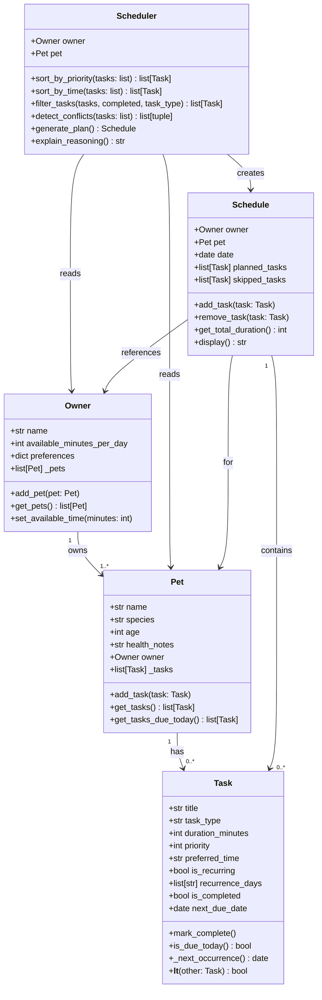

# PawPal+ Project Reflection

## 1. System Design

**a. Core user actions (Step 1)**

The three core actions a user should be able to perform in PawPal+ are:

1. **Add a pet** — The owner enters basic information about themselves and their pet (name, species, age, and any relevant health notes). This establishes the context for all scheduling decisions.

2. **Add and manage care tasks** — The owner creates tasks such as walks, feedings, medication reminders, grooming, or enrichment activities. Each task has at minimum a duration and a priority level, and may also have a preferred time window or recurrence pattern.

3. **Generate and view today's daily plan** — The system uses the owner's available time and the list of tasks (sorted by priority and constraints) to produce a concrete daily schedule. The plan is displayed clearly and explains why each task was placed where it was.

**b. Building blocks (Step 2)**

The main objects and their responsibilities:

**Owner**
- Attributes: `name`, `available_minutes_per_day`, `preferences` (e.g., preferred walk times)
- Methods: `add_pet(pet)`, `get_pets()`, `set_available_time(minutes)`

**Pet**
- Attributes: `name`, `species`, `age`, `health_notes`, `owner` (reference to Owner)
- Methods: `add_task(task)`, `get_tasks()`, `get_tasks_due_today()`

**Task**
- Attributes: `title`, `task_type` (walk/feeding/medication/grooming/enrichment), `duration_minutes`, `priority` (1–5 scale), `preferred_time` (optional time window), `is_recurring`, `recurrence_days` (e.g., ["Mon","Wed","Fri"]), `is_completed`
- Methods: `mark_complete()`, `is_due_today()`, `__lt__()` (for priority sorting)

**Schedule**
- Attributes: `date`, `pet`, `planned_tasks` (ordered list of Tasks), `total_duration_minutes`
- Methods: `add_task(task)`, `remove_task(task)`, `get_total_duration()`, `display()`

**Scheduler**
- Attributes: `owner`, `pet`
- Methods: `sort_by_priority(tasks)`, `detect_conflicts(tasks)`, `generate_plan()`, `explain_reasoning()`

**a. Initial design (Step 5)**

The system is built around five classes:

- **`Task`** (dataclass) — the atomic unit of the system. Holds everything needed to describe one care activity: its type, how long it takes, its priority (1–5), an optional preferred time, and whether it recurs on certain days of the week. It implements `__lt__` so Python's `sorted()` can rank tasks by priority natively.

- **`Pet`** (dataclass) — represents the animal being cared for. Owns a private list of `Task` objects and exposes methods to add tasks and filter to only those due today. Holds a back-reference to its `Owner` so ownership is navigable from either direction.

- **`Owner`** — represents the person using the app. Stores the owner's name, how many minutes per day they have available, and any scheduling preferences (e.g., preferred walk time). Manages a list of `Pet` objects.

- **`Schedule`** — a data container for the output of one planning run. Holds the `Owner`, the `Pet`, the date, an ordered list of planned tasks, and a list of tasks that were skipped due to time or conflict constraints. Its `display()` method renders the plan as human-readable text.

- **`Scheduler`** — the algorithm class. Takes an `Owner` and `Pet`, collects today's tasks, sorts by priority, greedily fills the time budget, detects time conflicts, and returns a populated `Schedule`. `explain_reasoning()` produces a plain-English summary of decisions made.

**c. Final UML diagram (updated in Phase 6 to match implementation)**

Changes from initial design: `Task` gained `next_due_date` and `_next_occurrence()`; `Schedule` gained `skipped_tasks` and an `Owner` reference; `Scheduler` gained `sort_by_time()` and `filter_tasks()`.

**b. Design changes (Step 5)**

During review of the skeleton, two gaps were identified and fixed:

1. **`Schedule` now holds a reference to `Owner`** — The original design had `Schedule` store only `pet` and `planned_tasks`. However, `Schedule.display()` and `Scheduler.explain_reasoning()` both need to know the owner's total available time budget (e.g., "plan uses 95 of 120 available minutes"). Without the `Owner` reference, `Schedule` couldn't surface this information without passing it in separately every time. Adding `owner` to `Schedule.__init__` keeps all plan context in one object.

2. **`Schedule` now has a `skipped_tasks` list** — The greedy scheduling algorithm fills time until the budget runs out, silently dropping lower-priority tasks. Without tracking which tasks were skipped, `explain_reasoning()` would have no way to tell the user *why* certain tasks were excluded. Adding `skipped_tasks: list[Task]` to `Schedule` gives the algorithm a place to record dropped tasks and gives the UI a way to show them.

---

## 2. Scheduling Logic and Tradeoffs

**a. Constraints and priorities**

The scheduler considers three constraints:

1. **Daily time budget** (`owner.available_minutes_per_day`) — the hard ceiling. No plan can exceed it.
2. **Task priority** (1–5 scale) — the primary sort key. Higher-priority tasks (medications, feedings) are always scheduled before lower-priority ones (grooming, enrichment).
3. **Preferred time** (`task.preferred_time`) — a secondary sort key used to break ties between tasks of equal priority and to detect scheduling conflicts.

Priority was chosen as the primary constraint because a pet's health needs (medication, feeding) should never be dropped in favour of optional activities regardless of time. Time budget is the hard constraint that determines what gets skipped, not priority.

**b. Tradeoffs**

The conflict detector compares time windows as `[start, start + duration)` intervals. This is more accurate than a simple exact-time-match check — for example, it correctly flags "Breakfast feeding" (07:30–07:40) conflicting with "Joint supplement" (07:35–07:40) even though they start at different times.

However, the detector still only fires for tasks that have a `preferred_time` set. Tasks without a preferred time are inserted into the plan without any time-slot awareness. A more sophisticated scheduler would assign concrete start times to every task and detect conflicts across the full timeline. The tradeoff is worth making here because assigning times to untimed tasks would require additional user input (or assumptions about the owner's day structure) that PawPal+ does not currently collect. Exact-window conflict detection on explicitly timed tasks catches the most important cases — overlapping medications or feedings — without burdening the user with mandatory time entry for every activity.

---

## 3. AI Collaboration

**a. How you used AI**

AI assistance was used throughout every phase of the project:

- **Design brainstorming (Phase 1–2):** AI helped identify the five core classes and their relationships by asking structured questions about what the system needed to *know* vs. what it needed to *do*. The most useful prompt pattern was "given this scenario, what objects would you model and why?" — it produced a starting design that was close to the final one.
- **Skeleton generation (Phase 2):** AI converted the UML description into Python class stubs with `@dataclass` decorators, correct type hints, and method signatures. This saved significant boilerplate time and immediately made the code feel structured.
- **Algorithm review (Phase 4):** Prompts like "review this method for missing edge cases" surfaced the `skipped_tasks` gap and the weakness of exact-time conflict detection before any bugs appeared in testing.
- **Test generation (Phase 5):** Prompts focused on edge cases ("what happens if every task exceeds the budget?" "what if the pet has no tasks?") produced tests that covered failure modes that were easy to overlook.

The most effective prompt pattern throughout was providing the existing code as context and asking "what is missing or could go wrong?" rather than "write me X feature."

**b. Judgment and verification**

The most important moment of non-acceptance was with the initial conflict detection design. The first AI suggestion used exact `preferred_time` string equality (`a.preferred_time == b.preferred_time`) to detect conflicts. This was rejected because it misses the most common real-world case: two tasks that start at *different* times but still overlap (e.g., a 10-minute feeding at 07:30 and a 5-minute medication at 07:35 share 5 minutes of the same window).

The suggestion was evaluated by manually tracing through a concrete example: Breakfast at 07:30 for 10 minutes ends at 07:40. If supplement is at 07:35, the two tasks are simultaneous for 5 minutes. Exact-match comparison would silently miss this. The replacement — interval intersection using `[start, start + duration)` — was verified correct by running the updated conflict test with overlapping but not equal start times, confirming it caught the case.

---

## 4. Testing and Verification

**a. What you tested**

The 27-test suite covers five main behaviour groups:

1. **Task state transitions** — `mark_complete()` sets `is_completed` for non-recurring tasks but advances `next_due_date` for recurring ones, keeping the task active. `is_due_today()` correctly reflects both states.
2. **Pet task management** — task count increases on `add_task()`; completed tasks are excluded from `get_tasks_due_today()`.
3. **Owner management** — back-references are set, multiple pets are tracked, and the time budget updates correctly.
4. **Scheduler algorithms** — priority ordering is respected; the time budget cap is never exceeded; `sort_by_time()` returns chronological order with untimed tasks last; `filter_tasks()` works by type and by status.
5. **Conflict detection** — partial overlaps are caught; non-overlapping tasks produce no false positives; untimed tasks are correctly ignored.

These tests were important because the scheduler's correctness is not visible to the user unless it fails dramatically. A subtle bug (wrong priority order, conflict missed) would silently produce a bad plan. Tests make the implicit contract of each method explicit and machine-verifiable.

**b. Confidence**

Confidence level: **4 / 5**

The core scheduling logic — priority ordering, time budget enforcement, recurring rescheduling, and conflict detection — is fully covered and all 27 tests pass. Confidence is not at 5 because:

- The Streamlit UI (`app.py`) is untested. A user interaction bug (e.g., session state not persisting correctly across tab switches) would not be caught.
- Multi-pet scenarios (two pets sharing one owner's time budget) are not tested at all; the current system schedules each pet independently.
- Edge cases like tasks with identical priority *and* identical preferred time have not been explicitly tested to confirm consistent ordering.

Next tests to add: UI integration tests using Streamlit's testing library; a test for the multi-pet shared budget scenario; a test confirming stable sort order for equal-priority, equal-time tasks.

---

## 5. Reflection

**a. What went well**

The most satisfying part of the project was the clean separation between the logic layer (`pawpal_system.py`) and the UI layer (`app.py`). Because `Scheduler`, `Schedule`, and `Task` were designed and tested independently of Streamlit, every feature could be verified in the terminal with `main.py` or `pytest` before touching the UI. This meant the UI phase was mostly "wiring" rather than debugging, and bugs were easy to isolate. The architecture held up across all four implementation phases without needing a major redesign.

**b. What you would improve**

The biggest design limitation is that the scheduler treats each pet independently. A more realistic system would have a single `DailyPlanner` that schedules tasks across all of an owner's pets simultaneously, detecting cross-pet time conflicts (e.g., you can't walk Buddy and give Luna her medication at 08:00 at the same time). This would require a more complex algorithm — probably interval scheduling rather than a greedy single-pass — and would make the conflict detection and time-budget logic significantly more powerful.

**c. Key takeaway**

The most important lesson from this project is that AI is most valuable as a *reviewer and edge-case finder*, not as a code generator. The generated code was often a good starting point, but the real quality improvements came from prompting AI to look for what was *missing* — the `skipped_tasks` list, the `Owner` reference on `Schedule`, the overlap-based conflict detection. Being the lead architect means treating AI output as a first draft to critique, not a finished solution to accept. Every suggestion that was rejected or modified produced a cleaner, more honest design than the original.
