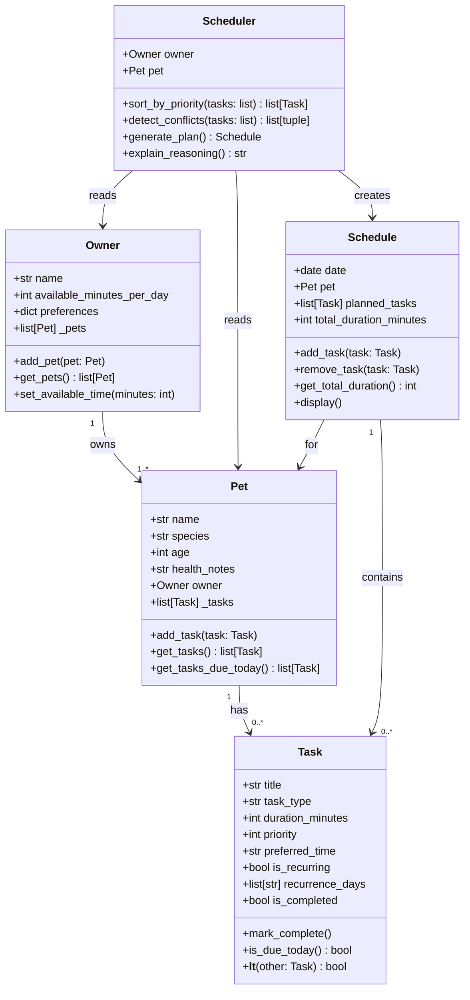

# PawPal+ Project Reflection

## 1. System Design

**a. Core user actions (Step 1)**

The three core actions a user should be able to perform in PawPal+ are:

1. **Add a pet** — The owner enters basic information about themselves and their pet (name, species, age, and any relevant health notes). This establishes the context for all scheduling decisions.

2. **Add and manage care tasks** — The owner creates tasks such as walks, feedings, medication reminders, grooming, or enrichment activities. Each task has at minimum a duration and a priority level, and may also have a preferred time window or recurrence pattern.

3. **Generate and view today's daily plan** — The system uses the owner's available time and the list of tasks (sorted by priority and constraints) to produce a concrete daily schedule. The plan is displayed clearly and explains why each task was placed where it was.

**b. Building blocks (Step 2)**

The main objects and their responsibilities:

**Owner**
- Attributes: `name`, `available_minutes_per_day`, `preferences` (e.g., preferred walk times)
- Methods: `add_pet(pet)`, `get_pets()`, `set_available_time(minutes)`

**Pet**
- Attributes: `name`, `species`, `age`, `health_notes`, `owner` (reference to Owner)
- Methods: `add_task(task)`, `get_tasks()`, `get_tasks_due_today()`

**Task**
- Attributes: `title`, `task_type` (walk/feeding/medication/grooming/enrichment), `duration_minutes`, `priority` (1–5 scale), `preferred_time` (optional time window), `is_recurring`, `recurrence_days` (e.g., ["Mon","Wed","Fri"]), `is_completed`
- Methods: `mark_complete()`, `is_due_today()`, `__lt__()` (for priority sorting)

**Schedule**
- Attributes: `date`, `pet`, `planned_tasks` (ordered list of Tasks), `total_duration_minutes`
- Methods: `add_task(task)`, `remove_task(task)`, `get_total_duration()`, `display()`

**Scheduler**
- Attributes: `owner`, `pet`
- Methods: `sort_by_priority(tasks)`, `detect_conflicts(tasks)`, `generate_plan()`, `explain_reasoning()`

**a. Initial design (Step 5)**

The system is built around five classes:

- **`Task`** (dataclass) — the atomic unit of the system. Holds everything needed to describe one care activity: its type, how long it takes, its priority (1–5), an optional preferred time, and whether it recurs on certain days of the week. It implements `__lt__` so Python's `sorted()` can rank tasks by priority natively.

- **`Pet`** (dataclass) — represents the animal being cared for. Owns a private list of `Task` objects and exposes methods to add tasks and filter to only those due today. Holds a back-reference to its `Owner` so ownership is navigable from either direction.

- **`Owner`** — represents the person using the app. Stores the owner's name, how many minutes per day they have available, and any scheduling preferences (e.g., preferred walk time). Manages a list of `Pet` objects.

- **`Schedule`** — a data container for the output of one planning run. Holds the `Owner`, the `Pet`, the date, an ordered list of planned tasks, and a list of tasks that were skipped due to time or conflict constraints. Its `display()` method renders the plan as human-readable text.

- **`Scheduler`** — the algorithm class. Takes an `Owner` and `Pet`, collects today's tasks, sorts by priority, greedily fills the time budget, detects time conflicts, and returns a populated `Schedule`. `explain_reasoning()` produces a plain-English summary of decisions made.

**c. Initial design (Step 3)**

The system uses five classes: `Owner`, `Pet`, `Task`, `Schedule`, and `Scheduler`. `Owner` holds one or more `Pet` objects; each `Pet` owns a list of `Task` objects. `Scheduler` reads from `Owner` and `Pet` to produce a `Schedule`, which is an ordered, time-constrained plan of `Task` objects for a given day. `Scheduler` is intentionally separate from `Schedule` so that the algorithm logic is decoupled from the data it outputs.

**b. Design changes (Step 5)**

During review of the skeleton, two gaps were identified and fixed:

1. **`Schedule` now holds a reference to `Owner`** — The original design had `Schedule` store only `pet` and `planned_tasks`. However, `Schedule.display()` and `Scheduler.explain_reasoning()` both need to know the owner's total available time budget (e.g., "plan uses 95 of 120 available minutes"). Without the `Owner` reference, `Schedule` couldn't surface this information without passing it in separately every time. Adding `owner` to `Schedule.__init__` keeps all plan context in one object.

2. **`Schedule` now has a `skipped_tasks` list** — The greedy scheduling algorithm fills time until the budget runs out, silently dropping lower-priority tasks. Without tracking which tasks were skipped, `explain_reasoning()` would have no way to tell the user *why* certain tasks were excluded. Adding `skipped_tasks: list[Task]` to `Schedule` gives the algorithm a place to record dropped tasks and gives the UI a way to show them.

---

## 2. Scheduling Logic and Tradeoffs

**a. Constraints and priorities**

The scheduler considers three constraints:

1. **Daily time budget** (`owner.available_minutes_per_day`) — the hard ceiling. No plan can exceed it.
2. **Task priority** (1–5 scale) — the primary sort key. Higher-priority tasks (medications, feedings) are always scheduled before lower-priority ones (grooming, enrichment).
3. **Preferred time** (`task.preferred_time`) — a secondary sort key used to break ties between tasks of equal priority and to detect scheduling conflicts.

Priority was chosen as the primary constraint because a pet's health needs (medication, feeding) should never be dropped in favour of optional activities regardless of time. Time budget is the hard constraint that determines what gets skipped, not priority.

**b. Tradeoffs**

The conflict detector compares time windows as `[start, start + duration)` intervals. This is more accurate than a simple exact-time-match check — for example, it correctly flags "Breakfast feeding" (07:30–07:40) conflicting with "Joint supplement" (07:35–07:40) even though they start at different times.

However, the detector still only fires for tasks that have a `preferred_time` set. Tasks without a preferred time are inserted into the plan without any time-slot awareness. A more sophisticated scheduler would assign concrete start times to every task and detect conflicts across the full timeline. The tradeoff is worth making here because assigning times to untimed tasks would require additional user input (or assumptions about the owner's day structure) that PawPal+ does not currently collect. Exact-window conflict detection on explicitly timed tasks catches the most important cases — overlapping medications or feedings — without burdening the user with mandatory time entry for every activity.

---

## 3. AI Collaboration

**a. How you used AI**

- How did you use AI tools during this project (for example: design brainstorming, debugging, refactoring)?
- What kinds of prompts or questions were most helpful?

**b. Judgment and verification**

- Describe one moment where you did not accept an AI suggestion as-is.
- How did you evaluate or verify what the AI suggested?

---

## 4. Testing and Verification

**a. What you tested**

- What behaviors did you test?
- Why were these tests important?

**b. Confidence**

- How confident are you that your scheduler works correctly?
- What edge cases would you test next if you had more time?

---

## 5. Reflection

**a. What went well**

- What part of this project are you most satisfied with?

**b. What you would improve**

- If you had another iteration, what would you improve or redesign?

**c. Key takeaway**

- What is one important thing you learned about designing systems or working with AI on this project?
